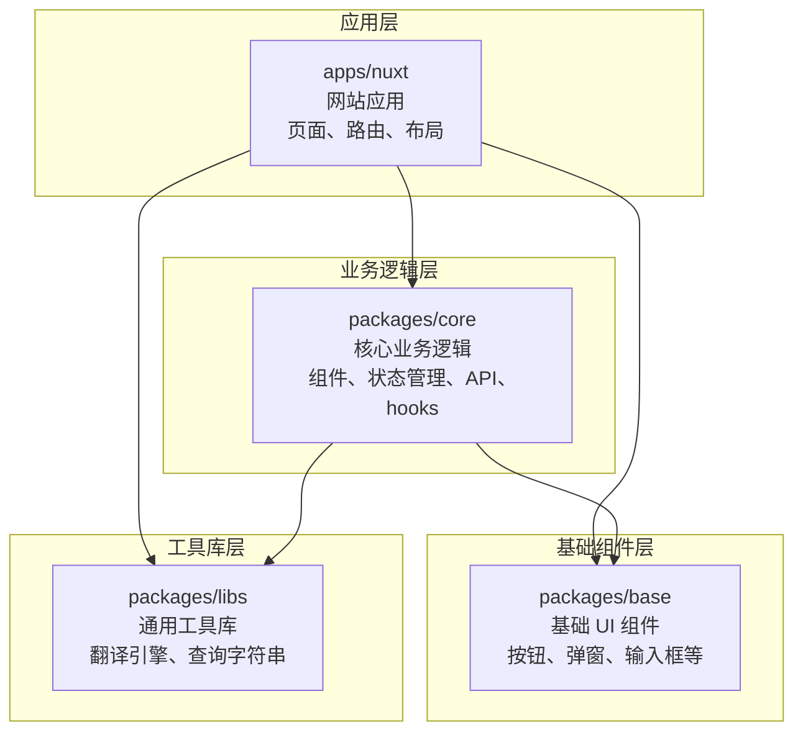

# TypeWords 项目学习导览

## 从 TypeScript / Vue 初学者视角理解项目结构与业务流程

---

> **阅读前提**：本文档假设你完全没有 TypeScript、Vue、Nuxt 或 pnpm monorepo 的经验，但有一定的编程基础（了解变量、函数、对象等概念）。本文档不是代码修改指南，而是帮助你通过阅读这个真实项目来学习现代前端技术栈。

---

## 目录

1. [项目整体导览](#一项目整体导览)
2. [项目入口分析](#二项目入口分析)
3. [各包之间的关系](#三各包之间的关系)
4. [TypeScript 学习视角](#四typescript-学习视角)
5. [Vue / Nuxt 学习视角](#五vue--nuxt-学习视角)
6. [核心业务流程分析](#六核心业务流程分析)
7. [推荐阅读路线](#七推荐阅读路线)
8. [附录：关键文件索引](#附录关键文件索引)

---

## 一、项目整体导览

### 1.1 这个项目是什么

**TypeWords**（词文记）是一个**在线英语和日语打字练习平台**。用户可以在浏览器中：

- 跟打单词（看到单词，输入对应拼写）
- 跟打文章（逐词输入整篇文章）
- 听写练习（听到发音，输入单词）
- 通过 FSRS（间隔重复算法）科学复习

项目官网为 `https://typewords.cc`，支持 14 种界面语言。

### 1.2 什么是 Monorepo？pnpm Workspace 在这里起什么作用？

**Monorepo**（单仓库）就是把多个相关但独立的"包"放在同一个 Git 仓库里管理。

打个比方：

- 传统方式（multirepo）：一个项目分 3 个 Git 仓库，改一处代码要分别提交 3 个仓库
- Monorepo 方式：3 个项目在一个仓库里，改一处代码一次提交搞定

**pnpm workspace** 是 pnpm（一个 Node.js 包管理器）提供的 monorepo 管理方案。

查看本项目的配置文件 `pnpm-workspace.yaml`（仓库根目录）：

```yaml
packages:
  - apps/nuxt
  - packages/*
```

这两行告诉 pnpm："`apps/nuxt` 目录和 `packages/` 下的每个子目录都是一个独立的子项目（包）"。pnpm 会自动处理它们之间的依赖关系。

**关键好处**：
- `apps/nuxt` 可以直接引用 `packages/core` 里的代码，不需要发布到 npm
- 所有包共享同一个 `pnpm-lock.yaml`，保证依赖版本一致
- 修改 `packages/core` 的代码，`apps/nuxt` 立刻生效

### 1.3 apps 和 packages 的区别

| 目录 | 性质 | 说明 |
|------|------|------|
| `apps/nuxt` | **应用**（Application） | 最终可运行、可部署的完整项目。这个项目里只有一个应用。 |
| `packages/base` | **包**（Package） | 可被应用引用的共享代码库。不独立运行，被应用依赖。 |
| `packages/core` | **包**（Package） | 同上 |
| `packages/libs` | **包**（Package） | 同上 |

你可以这样理解：
- **apps** = 可以吃的成品菜
- **packages** = 厨房里提前备好的调料/半成品

### 1.4 项目整体架构（用初学者能理解的方式）

```
TypeWords 项目
│
├── apps/nuxt/              ← 网站本身（页面、路由、布局）
│   ├── app/
│   │   ├── pages/          ← 各个页面（URL 对应的界面）
│   │   ├── layouts/        ← 页面外围框架（侧边栏等）
│   │   ├── plugins/        ← 启动时执行的初始化脚本
│   │   └── assets/         ← CSS 样式
│   ├── public/             ← 静态文件（词典数据 JSON、图片、音频）
│   ├── i18n/               ← 多语言翻译文件
│   └── nuxt.config.ts      ← Nuxt 框架的总配置文件
│
├── packages/core/          ← 核心业务逻辑（最关键的包）
│   ├── src/
│   │   ├── components/     ← Vue 组件（单词输入框、文章显示区等）
│   │   ├── stores/         ← Pinia 状态管理（数据存储中心）
│   │   ├── hooks/          ← 可复用的功能逻辑（发音、词典等）
│   │   ├── composables/    ← 数据同步、持久化等组合式函数
│   │   ├── utils/          ← 工具函数
│   │   ├── types/          ← TypeScript 类型定义
│   │   └── apis/           ← 与后端 API 通信的函数
│   └── package.json
│
├── packages/base/          ← 基础 UI 组件库（按钮、弹窗等）
│   └── src/
│       ├── BaseButton.vue
│       ├── Dialog.vue
│       └── ...（其他通用 UI 组件）
│
├── packages/libs/          ← 通用工具库（翻译、查询字符串等）
│   └── src/
│       ├── translate/      ← 翻译引擎（百度翻译）
│       └── qs.ts           ← URL 查询字符串工具
│
└── package.json            ← 根配置（定义全局 scripts 和依赖）
```

**数据流向简图**：

```
用户输入 → Vue 组件(packages/core/components)
           → Pinia Store(packages/core/stores)  ←→  IndexedDB(浏览器本地)
           → API 调用(packages/core/apis)      ←→  后端服务器
           → 界面更新
```

---

## 二、项目入口分析

### 2.1 项目启动入口

当你运行 `pnpm dev` 时发生了什么？

**第 1 步**：根 `package.json` 中的 scripts

查看文件：`/package.json`（第 7 行）

```json
"dev": "pnpm -F @typewords/nuxt dev"
```

`-F` 是 `--filter` 的缩写，意思是"只对名为 `@typewords/nuxt` 的包执行后面的命令"。所以这行等价于"进入 apps/nuxt 目录，执行 `pnpm dev`"。

**第 2 步**：`apps/nuxt/package.json` 中的 scripts

查看文件：`/apps/nuxt/package.json`（第 6 行）

```json
"dev": "nuxt dev"
```

这里调用了 `nuxt dev` 命令，这是 Nuxt 框架提供的开发服务器启动命令。

### 2.2 根 package.json 中的重要 scripts

| 命令 | 实际执行的操作 | 用途 |
|------|--------------|------|
| `pnpm dev` | 启动 Nuxt 开发服务器 | 本地开发 |
| `pnpm build` | 构建静态网站 | 生产部署 |
| `pnpm generate` | 生成静态网站并部署 | 部署到 Cloudflare Pages |
| `pnpm test` | （空） | 当前无测试 |

### 2.3 apps/nuxt 的入口文件和配置

#### nuxt.config.ts —— 总配置文件

文件：`/apps/nuxt/nuxt.config.ts`

这是 Nuxt 应用的"总控制中心"，决定了应用的一切行为。对于初学者，先关注以下几个关键配置：

```typescript
// 开发服务器端口
devServer: { port: 5567 }

// 路由规则：决定每个 URL 对应的行为
routeRules: {
  '/': { redirect: '/word' },           // 访问根路径 → 重定向到 /word
  '/word': { ssr: false },              // 单词练习页 → 纯客户端渲染
  '/words': { ssr: false },             // 词库选择页 → 纯客户端渲染
}

// 启用的模块（插件系统）
modules: ['@pinia/nuxt', '@unocss/nuxt', ...]

// 路径别名：@ 指向 app/ 目录
alias: { '@': resolve(__dirname, 'app') }

// 多语言配置：14 种语言，默认中文
i18n: {
  defaultLocale: 'zh',
  strategy: 'no_prefix',  // URL 不加语言前缀
}
```

#### app.vue —— Vue 应用的根组件

文件：`/apps/nuxt/app/app.vue`

```vue
<template>
  <NuxtLayout>
    <NuxtPage />
  </NuxtLayout>
</template>
```

这是整个应用的"骨架"，仅 3 行：
- `<NuxtLayout>` 根据当前路由自动选择布局组件（默认是 `layouts/default.vue`）
- `<NuxtPage>` 根据当前 URL 自动渲染对应的页面组件

#### layouts/default.vue —— 默认布局

文件：`/apps/nuxt/app/layouts/default.vue`

提供了所有页面的"外围框架"：
- 左侧可折叠侧边栏（导航菜单）
- 移动端底部导航
- 语言切换器
- 主题切换按钮

#### 页面文件（pages/ 目录）

Nuxt 的**文件即路由**系统：在 `pages/` 目录下创建一个 `.vue` 文件，该文件就会自动对应一个 URL。

例如（文件 → URL）：
- `pages/(words)/words.vue` → `/words`（词库选择页）
- `pages/(words)/practice-words/[id].vue` → `/practice-words/xxx`（单词练习页，`[id]` 是动态参数）
- `pages/setting.vue` → `/setting`（设置页）

### 2.4 从运行 pnpm dev 到页面显示的大致流程

```
1. 终端执行 pnpm dev
   ↓
2. pnpm 读取 pnpm-workspace.yaml，找到 apps/nuxt
   ↓
3. 在 apps/nuxt 中执行 nuxt dev
   ↓
4. Nuxt 读取 nuxt.config.ts 获取所有配置
   ↓
5. Nuxt 扫描 pages/ 目录，自动生成路由表
   ↓
6. Nuxt 启动 Vite 开发服务器（端口 5567）
   ↓
7. Nuxt 加载所有模块（Pinia、UnoCSS、i18n 等）
   ↓
8. Nuxt 执行 plugins/ 目录下的插件（初始化脚本）
   ↓
9. 浏览器访问 http://localhost:5567
   ↓
10. Nuxt 渲染 app.vue
    ↓
11. <NuxtLayout> 加载 layouts/default.vue（默认布局）
    ↓
12. <NuxtPage> 根据 URL 加载对应的 pages/ 文件
    ↓
13. default.vue 中 onMounted 调用 useInit()
    ↓
14. useInit() 从 IndexedDB 加载数据，初始化 stores
    ↓
15. 页面渲染完成，可以开始使用
```

---

## 三、各包之间的关系

### 3.1 apps/nuxt 如何引用其他包

在 `apps/nuxt/package.json` 中声明依赖：

```json
"dependencies": {
  "@typewords/base": "workspace:*",
  "@typewords/libs": "workspace:*",
  "@typewords/core": "workspace:*"
}
```

`workspace:*` 表示"使用本地 workspace 中的最新版本"，不会去 npm 下载。

然后在代码中直接 import：

```typescript
// apps/nuxt/app/layouts/default.vue 中的引用示例
import { BaseIcon, ToastComponent } from '@typewords/base'
import Logo from '@typewords/core/components/Logo.vue'
import { useInit } from '@typewords/core/composables/useInit.ts'
import { ShortcutKey } from '@typewords/core/types/enum.ts'
```

### 3.2 packages/core 如何依赖其他包

查看 `packages/core/package.json`：

```json
"dependencies": {
  "@typewords/base": "workspace:*",
  "@typewords/libs": "workspace:*",
  "wanakana": "^5.3.1"
}
```

core 依赖 base（UI 组件）和 libs（翻译工具），以及 wanakana（日语罗马音转换）。

### 3.3 packages/libs 和 packages/base 的依赖

- **libs** 没有依赖任何其他 workspace 包（独立库）
- **base** 没有依赖任何其他 workspace 包（独立 UI 库）

### 3.4 依赖关系总览

**文字描述**：

- `apps/nuxt` 依赖所有三个包（base、core、libs）
- `packages/core` 依赖 base 和 libs
- `packages/base` 和 `packages/libs` 各自独立，不依赖其他包

**Mermaid 图**：



### 3.5 每个包主要负责什么，适合从哪里开始阅读

| 包 | 一句话职责 | 适合初学者先读的文件 | 为什么先读这些 |
|----|----------|-------------------|--------------|
| **packages/base** | 通用 UI 组件 | `src/BaseButton.vue`、`src/types.ts` | 文件小，结构简单，容易理解 Vue SFC 的基本写法 |
| **packages/libs** | 通用工具库 | `src/qs.ts`、`src/translate/languages/languages.ts` | 纯 TypeScript，无 Vue，专注理解 TS 语法 |
| **packages/core** | 核心业务 | `src/types/types.ts`、`src/types/enum.ts` | 先理解"数据长什么样"，再去看逻辑 |
| **apps/nuxt** | 网站应用 | `app/app.vue`、`nuxt.config.ts` | 理解应用骨架和配置 |

---

## 四、TypeScript 学习视角

TypeScript（TS）是 JavaScript 的超集，给 JS 增加了**类型系统**。它的核心价值是：**在写代码时就发现潜在错误，而不是等运行时崩溃**。

### 4.1 type（类型别名）—— 给类型起名字

文件：`/packages/base/src/types.ts`

```typescript
export type ButtonProps = {
  keyboard?: string
  active?: boolean
  disabled?: boolean
  loading?: boolean
  size?: 'small' | 'normal' | 'large'
  type?: 'primary' | 'info' | 'orange'
}
```

**逐行解释**：
- `type ButtonProps = { ... }` —— 定义了一个名为 `ButtonProps` 的类型，描述按钮组件需要哪些属性
- `keyboard?: string` —— 问号表示这个属性**可选**（可以传也可以不传）
- `size?: 'small' | 'normal' | 'large'` —— 联合类型（Union Type），`size` 只能是这三个字符串之一，写别的会报错

**它在本项目中解决了什么问题？**
当你使用 `<BaseButton size="smol" />` 时，编辑器会立刻标红提示你拼写错误，因为这不在 `'small' | 'normal' | 'large'` 之中。

### 4.2 interface（接口）—— 描述对象结构

文件：`/packages/core/src/types/types.ts`

```typescript
export interface Word {
  word: string
  phonetic0: string
  phonetic1: string
  trans: string[]
  sentences: Sentence[]
  phrases: Phrase[]
  synos: Word[]
  relWords: string[]
  etymology: string
  id: string
  reading?: string        // 日语读音（假名），可选
  language?: LanguageType  // 词条语言
  dictId?: string
  audio?: string
  chapter?: string
}
```

**逐行解释**：
- `interface Word { ... }` —— 定义一个接口，描述"单词"对象必须有哪些字段
- `trans: string[]` —— `string[]` 表示"字符串数组"
- `sentences: Sentence[]` —— 数组里放的是另一个接口（`Sentence`）类型的对象
- `reading?: string` —— 可选字段，只有日语单词才有

**type 和 interface 的区别**（对这个项目初学者来说）：两者非常相似，本项目混用。简单记住：
- `interface` 更适合描述"对象结构"（如 Word、Article）
- `type` 更适合"联合类型"和"类型别名"（如 `LanguageType`）

### 4.3 enum（枚举）—— 一组有名字的常量

文件：`/packages/core/src/types/enum.ts`

```typescript
export enum WordPracticeMode {
  System = 0,
  Free = 1,
  IdentifyOnly = 2,
  DictationOnly = 3,
  ListenOnly = 4,
  Shuffle = 5,
  Review = 6,
  ShuffleWordsTest = 7,
  ReviewWordsTest = 8,
}
```

**逐行解释**：
- `enum WordPracticeMode { ... }` —— 定义了一个枚举，给每个数字一个人类可读的名字
- `System = 0` —— 系统模式对应数字 0
- 使用：`settingStore.wordPracticeMode === WordPracticeMode.Free` —— 比写 `=== 1` 更容易理解

**它在本项目中解决了什么问题？**
表示练习模式时，写 `WordPracticeMode.DictationOnly` 一目了然，写 `3` 则无人能懂。

### 4.4 泛型（Generics）—— 让类型也变成"参数"

文件：`/packages/libs/src/translate/translator/translator.ts`

```typescript
export abstract class Translator<Config extends {} = {}> {
  config: Config

  constructor(init: TranslatorInit<Config> = {}) {
    this.config = init.config || ({} as Config)
  }

  abstract getSupportLanguages(): Languages

  async translate(
    text: string,
    from: Language,
    to: Language,
    config = {} as Config
  ): Promise<TranslateResult> {
    // ...
  }
}
```

**逐行解释**：
- `Translator<Config extends {} = {}>` —— `Config` 是一个**类型参数**（泛型），就像一个"类型的变量"
- `extends {}` 表示 Config 必须是对象类型
- `= {}` 表示默认值是空对象类型
- 子类可以指定具体类型：`class Baidu extends Translator<BaiduConfig>` —— 这里的 `Config` 被替换为 `BaiduConfig`

**它在本项目中解决了什么问题？**
不同翻译引擎（百度、谷歌等）需要不同的配置（百度需要 appid+key，谷歌可能需要 apiKey），泛型让基类 `Translator` 可以适配任意配置类型，不用写死。

### 4.5 类型导入导出 —— 如何跨文件共享类型

```typescript
// 定义并导出类型（types/types.ts）
export type LanguageType = 'en' | 'ja' | 'de' | 'code'
export interface Word { ... }

// 重新导出（types/index.ts）
export * from './types'
export * from './enum'

// 在其他文件中导入类型（使用 type 关键字）
import type { Word, LanguageType } from '../../types'

// 混合导入：同时导入类型和运行时的值
import { getDefaultWord, WordPracticeType } from '../../types'
```

**`import type` 和 `import` 的区别**：
- `import type { Word }` —— 只在编译时使用，编译后的 JS 代码中不会出现。用于**仅作类型标注**的东西
- `import { getDefaultWord }` —— 运行时真正使用的函数/值，会留在编译后的代码里

### 4.6 联合类型与字面量类型 —— 限定取值范围

文件：`/packages/core/src/types/types.ts`

```typescript
export type LanguageType = 'en' | 'ja' | 'de' | 'code'
```

这是一个**字符串字面量联合类型**：`LanguageType` 类型的变量**只能是**这四个字符串之一。编译器会阻止你写 `'fr'` 等不支持的语言。

文件：`/packages/core/src/utils/japanese.ts`

```typescript
export type JapanesePracticeInputMode = 'kanji' | 'romaji'
```

日语输入模式只能是 `kanji`（汉字输入）或 `romaji`（罗马音输入），不能是别的。

### 4.7 项目中 TypeScript 解决的实际问题

1. **防止拼写错误**：属性名拼错、枚举值写错，编辑器立刻标红
2. **组件传参安全**：`defineProps<{ word: Word }>()` 确保传给组件的数据结构正确
3. **跨包引用安全**：改了一个包的类型定义，引用该类型的其他包会立刻报错提示
4. **API 返回值可预测**：定义 `TranslateResult` 接口后，所有翻译引擎都必须返回这个结构

---

## 五、Vue / Nuxt 学习视角

### 5.1 典型的 Vue SFC（单文件组件）

SFC = Single File Component，一个 `.vue` 文件就是一个组件。它包含三个部分：

以 `packages/base/src/BaseButton.vue` 为例：

```vue
<!-- 1. 脚本部分：组件逻辑 -->
<script setup lang="ts">
import { ButtonProps } from './types.ts'

withDefaults(defineProps<ButtonProps>(), {
  type: 'primary',
  size: 'normal',
})
defineEmits(['click'])
</script>

<!-- 2. 模板部分：HTML 结构 -->
<template>
  <Tooltip :disabled="!keyboard" :title="`${keyboard}`">
    <div
      class="base-button"
      @click="e => !disabled && !loading && $emit('click', e)"
      :class="[active && 'active', size, type, (disabled || loading) && 'disabled']"
    >
      <span :style="{ opacity: loading ? 0 : 1 }"><slot></slot></span>
      <IconEosIconsLoading v-if="loading" class="loading" width="18" />
    </div>
  </Tooltip>
</template>

<!-- 3. 样式部分：CSS -->
<style scoped lang="scss">
.base-button {
  position: relative;
  cursor: pointer;
  &.primary { background: var(--btn-primary); }
  &.disabled { opacity: 0.6; cursor: not-allowed; }
}
</style>
```

#### 三个部分的解释：

**`<script setup lang="ts">`**：
- `setup` 是 Vue 3 的简化写法，不需要写 `export default`
- `lang="ts"` 表示使用 TypeScript
- `defineProps` 声明该组件接收哪些外部参数
- `defineEmits` 声明该组件可以触发哪些事件

**`<template>`**：
- 写 HTML 结构
- `@click` = 点击事件监听（等价于 `v-on:click`）
- `:class` = 动态 class（等价于 `v-bind:class`），`:` 前缀表示这是个 JS 表达式
- `<slot></slot>` 是"插槽"，父组件传进来的内容会显示在这里
- `v-if` 条件渲染：只有 `loading` 为 true 时才渲染加载图标

**`<style scoped lang="scss">`**：
- `scoped` 表示这里的样式只对这个组件生效，不会污染别的组件
- `lang="scss"` 表示使用 SCSS（CSS 的增强版，支持嵌套和变量）

### 5.2 组件之间如何传参

#### 父传子：Props（属性）

父组件传值给子组件：

```vue
<!-- 父组件 -->
<TypeWord :word="currentWord" :question="currentQuestion" @complete="handleComplete" />
```

子组件接收：

```typescript
// 子组件 TypeWord.vue
interface IProps {       // 定义接收哪些属性
  word: Word             // 必传：当前要练习的单词
  question?: Question    // 可选：选择题数据
}
const props = withDefaults(defineProps<IProps>(), {
  word: () => getDefaultWord(),  // 默认值
})
// 现在可以通过 props.word 访问传入的单词
```

#### 子传父：Emits（事件）

子组件通知父组件：

```typescript
// 子组件 TypeWord.vue
const emit = defineEmits<{
  complete: []    // 练习完成（无参数）
  wrong: []       // 输入错误（无参数）
  skip: []        // 跳过（无参数）
}>()

// 某个时机触发事件
emit('complete')
```

父组件监听：

```vue
<TypeWord @complete="handleComplete" @wrong="handleWrong" />
```

### 5.3 组件、页面、Composable、Store 的区别

| 概念 | 在这个项目中的例子 | 作用 |
|------|-------------------|------|
| **组件**（Component） | `TypeWord.vue`、`BaseButton.vue` | 可复用的 UI 片段 |
| **页面**（Page） | `pages/(words)/practice-words/[id].vue` | 对应一个 URL，组合多个组件 |
| **Composable** | `composables/useInit.ts` | 可复用的**有状态逻辑**，不渲染 UI |
| **Store** | `stores/practice.ts`、`stores/setting.ts` | 全局状态管理，多个组件共享数据 |
| **Hook** | `hooks/sound.ts`、`hooks/event.ts` | 封装特定功能的组合式函数 |

**Composable 和 Hook 的区别**（本项目中）：两者非常相似，都是 `useXxx()` 形式的函数。本项目中：
- `hooks/` 更偏底层功能（发音、事件监听、词典操作）
- `composables/` 更偏业务逻辑（数据同步、初始化、持久化）

### 5.4 状态管理：Pinia Store

Store 是多个组件之间的**共享数据中心**。在这个项目中，5 个 Store 各司其职：

| Store | 文件 | 管理的数据 |
|-------|------|-----------|
| `useBaseStore` | `stores/base.ts` | 词典列表、学习进度、FSRS 卡片、收藏/错词 |
| `useSettingStore` | `stores/setting.ts` | 用户所有设置项（70+ 项） |
| `usePracticeStore` | `stores/practice.ts` | 当前练习会话的状态（阶段、用时、错误数） |
| `useRuntimeStore` | `stores/runtime.ts` | 运行时 UI 状态（弹窗、加载、全局路由） |
| `useUserStore` | `stores/user.ts` | 用户登录状态、token |

以 `usePracticeStore` 为例（文件：`packages/core/src/stores/practice.ts`）：

```typescript
export const usePracticeStore = defineStore('practice', {
  state: (): PracticeState => ({
    stage: WordPracticeStage.FollowWriteNewWord,  // 当前阶段
    spend: 0,          // 学习用时（毫秒）
    total: 0,          // 总输入单词数
    wrong: 0,          // 错误次数
    timerPaused: false, // 计时是否暂停
    segments: [],      // 学习时间片段
  }),
  getters: {
    getStageName: state => WordPracticeStageNameMap[state.stage],
  },
  actions: {
    pauseTimer(reason) { /* 暂停计时 */ },
    resumeTimer() { /* 恢复计时 */ },
  },
})
```

在任何组件中使用：

```typescript
const practiceStore = usePracticeStore()
console.log(practiceStore.stage)      // 读
practiceStore.total++                 // 写（直接修改即可）
practiceStore.pauseTimer('manual')    // 调用 action
```

### 5.5 Nuxt 中的特殊目录

本项目使用的 Nuxt 约定目录：

| 目录 | 作用 | 本项目中的内容 |
|------|------|--------------|
| `pages/` | URL 路由对应的页面 | 词库页、练习页、设置页等 |
| `layouts/` | 页面共用框架 | `default.vue`（带侧边栏）、`empty.vue`（空白） |
| `components/` | 可复用组件 | 无极路由页面组件（组件统一放在 `packages/core`） |
| `plugins/` | 应用初始化脚本 | 错误处理、第三方库注册、自定义指令 |
| `composables/` | 可复用逻辑 | 数据同步、持久化（统一放在 `packages/core`） |
| `server/` | 服务端 API | `api/articles.get.ts` |
| `public/` | 静态文件 | 词典 JSON、图片、音频 |
| `i18n/` | 多语言翻译 | 14 种语言的 locale JSON 文件 |

**未在本项目中出现的 Nuxt 约定目录**：`middleware/`（路由中间件）—— 本项目没有使用。

### 5.6 Vue 特有的响应式语法（本项目中的使用）

Vue 3 的响应式系统让"数据变 → 界面自动变"。本项目中使用了多种方式：

```typescript
// 1. ref —— 包装基本类型
let wrongTimes = ref(0)
wrongTimes.value++  // 修改后，界面自动更新

// 2. $ref —— Vue Macros 语法糖（本项目的编译宏）
let input = $ref('')    // 等价于 const input = ref('')，但不需要 .value
input = 'hello'         // 直接赋值，界面自动更新

// 3. $computed —— 计算属性（依赖其他数据自动计算）
const currentTypingWord = $computed(() => {
  return props.article.sections?.[sectionIndex]?.[sentenceIndex]?.words?.[wordIndex]
})
// 当 sectionIndex/sentenceIndex/wordIndex 任一个变化时，自动重新计算

// 4. watch —— 监听数据变化
watch(() => settingStore.theme, (newTheme) => {
  setTheme(newTheme)    // 主题变了，自动切换
})
```

---

## 六、核心业务流程分析

### 6.1 流程一：单词练习

这是最核心的业务流程。用户选择一本词库，逐词练习输入。

#### 用户操作路径

1. 访问 `/word` → 重定向到 `/words`（词库选择页）
2. 选择一个词库 → 跳转到 `/practice-words/[词库ID]`
3. 页面显示当前单词，用户对照输入
4. 输入正确 → 播放正确音效 → 自动跳到下一个词
5. 输入错误 → 显示正确答案 → 记录到错词本
6. 一轮完成后显示统计，可以选择继续练习或返回

#### 涉及的关键文件

| 角色 | 文件 | 做什么 |
|------|------|--------|
| 页面入口 | `apps/nuxt/app/pages/(words)/practice-words/[id].vue` | 管理练习会话：加载词库、生成任务词、控制流程 |
| 核心输入组件 | `packages/core/src/components/word/TypeWord.vue` | 显示单词、处理键盘输入、判断对错 |
| 布局组件 | `packages/core/src/components/PracticeLayout.vue` | 练习页的三栏布局（练习区、面板、底部栏） |
| 音效 | `packages/core/src/hooks/sound.ts` | 播放按键音、正确/错误音效、单词发音 |
| 练习状态 | `packages/core/src/stores/practice.ts` | 记录当前阶段、用时、错误次数 |
| 词典数据 | `packages/core/src/stores/base.ts` | 存储词库内容、学习进度、收藏/错词 |
| 设置 | `packages/core/src/stores/setting.ts` | 读取用户练习偏好（自动下一词、重复次数等） |
| 持久化 | `packages/core/src/composables/usePracticePersistence.ts` | 保存/恢复练习进度（断点续练） |
| 日语工具 | `packages/core/src/utils/japanese.ts` | 罗马音模式下计算输入目标 |
| 词汇操作 | `packages/core/src/hooks/dict.ts` | 收藏/标记已掌握/移除错词 |

#### 数据流

```
1. practice-words/[id].vue 加载
   ↓
2. loadDict() → 从 baseStore.sdict 或远程获取词库数据
   ↓
3. initData() → 从持久化缓存恢复上次练习进度
   ↓              （调用 usePracticeWordPersistence().load()）
4. 生成 TaskWords（新词 + 复习词），按练习模式排序
   ↓
5. 将当前 Word 传给 TypeWord 组件
   ↓
6. TypeWord 监听键盘事件（keydown/input/composition）
   ↓
7. 逐字符比对输入与目标
   ├── 全匹配 → emit('complete') → 播放正确音效 → next()
   └── 不匹配 → 记录错词 → emit('wrong') → 播放错误音效
   ↓
8. next() 更新 practiceStore 统计、保存进度到持久化缓存
   ↓
9. 检查是否还有剩余词 → 有则跳到下一个，无则显示统计面板
```

#### 日语练习的特殊处理

当 `word.language === 'ja'` 时：

```typescript
// TypeWord.vue 中
const isJapaneseWord = $computed(() => props.word.language === 'ja')
const practiceTarget = $computed(() =>
  getJapanesePracticeTarget(props.word, settingStore.japanesePracticeInputMode, isJapaneseWord)
)
```

- **汉字模式**（kanji）：输入目标就是日语汉字本身
- **罗马音模式**（romaji）：输入目标是 `word.reading` 转换后的罗马音（用 wanakana 库的 `toRomaji`）
- 罗马音模式下显示隐藏 IME 输入框，防止系统输入法干扰

### 6.2 流程二：文章跟打

逐词输入整篇文章，与单词练习类似但更复杂（需要处理句子、段落、标点符号）。

#### 用户操作路径

1. 访问 `/articles` → 文章库选择页
2. 选择一篇文章 → 跳转到 `/practice-articles/[文章ID]`
3. 逐个输入文章中的单词（标点符号会自动跳过或计入）
4. 输完一个句子进入下一个句子，输完所有句子完成
5. 可以编辑文章内容、查看问题列表

#### 涉及的关键文件

| 角色 | 文件 | 做什么 |
|------|------|--------|
| 页面入口 | `apps/nuxt/app/pages/(articles)/practice-articles/[id].vue` | 管理文章练习会话 |
| 核心输入组件 | `packages/core/src/components/article/TypingArticle.vue` | 显示文章段落、处理逐词输入、光标定位 |
| 单个打字词 | `packages/core/src/components/article/TypingWord.vue` | 文章中单个词的高亮和输入状态显示 |
| 文章解析 | `packages/core/src/hooks/article.ts` | 将文章段落拆分为 TypingWord 数组（单词、数字、符号） |
| 文章组件 | `packages/core/src/components/article/EditArticle.vue` | 编辑文章内容 |
| 持久化 | `packages/core/src/composables/usePracticePersistence.ts` | `usePracticeArticlePersistence()` |

#### 数据流

```
1. practice-articles/[id].vue 加载
   ↓
2. init() → 获取文章数据（从 baseStore 的 article bookList）
   ↓
3. setArticle() → 调用 parseSentence() 将文章句子拆分为词元（token）
   ↓              parseSentence 使用正则匹配：
   ↓                - 日语文本（汉字+假名+片假名）
   ↓                - 货币+数字（$1,000.50）
   ↓                - 带点缩写（U.S.A.）
   ↓                - 英文单词（含撇号/连字符）
   ↓                - 标点符号（单字符）
   ↓
4. 恢复上次练习进度（sectionIndex/sentenceIndex/wordIndex）
   ↓
5. 将当前 ArticleWord 传给 TypingWord 组件
   ↓
6. 用户输入 → 逐字符比对 → 匹配则自动跳下一个词
   ↓
7. 一个句子完成 → 进入下一个句子
   ↓
8. 所有句子完成 → 显示完成状态
```

### 6.3 流程三：应用初始化与数据同步

这是理解整个应用如何"活起来"的关键流程。

#### 涉及的关键文件

| 角色 | 文件 | 做什么 |
|------|------|--------|
| 布局触发 | `apps/nuxt/app/layouts/default.vue` | 在 `onMounted` 时调用 `useInit()` |
| 初始化协调 | `packages/core/src/composables/useInit.ts` | 协调所有 Store 的加载和同步 |
| 数据同步 | `packages/core/src/composables/useDataSyncPersistence.ts` | 本地与远程数据同步（快照/哈希守卫） |
| Base Store | `packages/core/src/stores/base.ts` | 从 IndexedDB 加载词典数据 |
| Setting Store | `packages/core/src/stores/setting.ts` | 从 IndexedDB 加载用户设置 |
| 持久化 | `packages/core/src/composables/usePracticePersistence.ts` | 练习进度本地持久化 |

#### 初始化流程

```
1. layouts/default.vue onMounted
   ↓
2. const init = useInit()   → 创建初始化函数
   ↓
3. await init() 执行：
   ↓
4. await ensureHashGuardBeforeInit()
   → 确保本地数据完整性（创建快照）
   ↓
5. await store.init()
   → 从 IndexedDB 读取词典数据（收藏、错词、学习进度等）
   → 尝试从远程 API 合并数据
   ↓
6. await settingStore.init()
   → 从 IndexedDB 读取用户设置
   → 版本升级：checkAndUpgradeSaveSetting()
   ↓
7. await dataSync.syncData({ dict, setting })
   → 与服务器同步数据（拉取远程最新版本）
   → 如有冲突，显示冲突解决弹窗
   ↓
8. settingStore.load = true
   store.load = true
   → 标记加载完成，其他 watch 开始生效
   ↓
9. 注册 Store 订阅（$subscribe）
   → store 数据变化时自动防抖保存到 IndexedDB 并同步到服务器
   → 监听 visibilitychange（切换标签页回来时重新同步）
```

**关键设计**：
- 使用 `IndexedDB`（idb-keyval）做本地存储，比 localStorage 容量大
- 使用**快照哈希守卫**机制防止数据冲突：先对比本地和远程的快照哈希，如果远程更新则拉取，本地更新则推送
- Store 的 `$subscribe` + `debounce(1000ms)` 实现**自动保存**：用户操作后 1 秒自动存盘

---

## 七、推荐阅读路线

### 第一阶段：了解项目如何启动（预估 30 分钟）

**目标**：理解项目怎么跑起来，页面怎么被渲染出来。

| 顺序 | 阅读文件 | 重点看什么 | 时长 |
|------|---------|-----------|------|
| 1 | `/package.json` | `scripts` 部分和 `dependencies` | 5min |
| 2 | `/pnpm-workspace.yaml` | 了解工作空间包含了哪些目录 | 2min |
| 3 | `/apps/nuxt/nuxt.config.ts` | `routeRules`、`modules`、`alias`、`i18n` | 10min |
| 4 | `/apps/nuxt/app/app.vue` | 根组件只有 3 行，理解 `<NuxtLayout>` 和 `<NuxtPage>` | 2min |
| 5 | `/apps/nuxt/app/layouts/default.vue` | 侧边栏、`useInit()` 调用、watch 用法 | 10min |

**检验标准**：能用自己的话说出"从终端输入 `pnpm dev` 到浏览器显示页面，中间每一步发生了什么"。

### 第二阶段：了解页面和组件（预估 45 分钟）

**目标**：理解 Vue SFC 的结构、组件如何传参、页面如何组合组件。

| 顺序 | 阅读文件 | 重点看什么 | 时长 |
|------|---------|-----------|------|
| 1 | `/packages/base/src/types.ts` | 最简单的类型定义 | 2min |
| 2 | `/packages/base/src/BaseButton.vue` | 三个部分（script/template/style）、Props、Emits、slot | 10min |
| 3 | `/packages/base/src/dialog/Dialog.vue` | 复杂一些的组件（Teleport、动画、modalStack） | 10min |
| 4 | `/packages/core/src/components/PracticeLayout.vue` | 插槽（`<slot name="...">`）的实际用法 | 5min |
| 5 | `/packages/core/src/components/word/WordItem.vue` | 组件组合（引用子组件、props 默认值） | 5min |
| 6 | `/apps/nuxt/app/pages/setting.vue` | 页面如何从头到尾组织（可以只看前 200 行） | 10min |

**检验标准**：能看懂一个 Vue 组件的基本结构，知道 Props 怎么传、事件怎么发、插槽怎么用。

### 第三阶段：了解状态和业务逻辑（预估 1 小时）

**目标**：理解 Pinia Store 的工作方式、数据如何存储和同步。

| 顺序 | 阅读文件 | 重点看什么 | 时长 |
|------|---------|-----------|------|
| 1 | `/packages/core/src/types/types.ts` | 所有核心类型定义，先理解"数据长什么样" | 10min |
| 2 | `/packages/core/src/types/enum.ts` | 各种枚举，理解练习模式/阶段/快捷键等 | 10min |
| 3 | `/packages/core/src/stores/practice.ts` | 最简单的 Store（仅 76 行），理解 state/getters/actions | 10min |
| 4 | `/packages/core/src/stores/setting.ts` | 设置 Store（前 100 行），理解 state 的规模 | 10min |
| 5 | `/packages/core/src/composables/useInit.ts` | 初始化流程（130 行），理解 store.$subscribe | 10min |
| 6 | `/packages/core/src/stores/base.ts` | 最复杂的 Store，了解词典管理 | 15min |

**检验标准**：能理解 Store 的 state → getter → action 模式，知道 `$subscribe` 如何实现自动保存。

### 第四阶段：了解包之间复用关系（预估 30 分钟）

**目标**：理解 monorepo 中包与包之间如何引用。

| 顺序 | 阅读文件 | 重点看什么 | 时长 |
|------|---------|-----------|------|
| 1 | `/packages/libs/src/translate/languages/languages.ts` | 纯 TS 文件，理解 `as const` 和类型推导 | 5min |
| 2 | `/packages/libs/src/translate/translator/translator.ts` | 抽象类、泛型用法 | 10min |
| 3 | `/packages/libs/src/translate/baidu.ts` | 具体实现，理解继承和多态 | 10min |
| 4 | `/packages/base/src/index.ts` | 看一个包如何"导出"所有组件 | 3min |
| 5 | `/packages/core/src/index.ts` | 再看一个包的导出入口 | 2min |

**检验标准**：能画出包之间的依赖关系图，理解 `workspace:*` 的含义。

### 学有余力：深入具体业务流程

- **单词练习全流程**：从 `practice-words/[id].vue` 开始，跟踪 `next()` 函数的每次调用
- **键盘事件处理**：阅读 `hooks/event.ts` 和 `TypeWord.vue` 中 `onKeydown` 的实现
- **日语支持**：阅读 `utils/japanese.ts` 和 `TypeWord.vue` 中日语相关的所有逻辑

---

## 附录：关键文件索引

### apps/nuxt（网站应用）

| 文件路径 | 作用 |
|---------|------|
| `nuxt.config.ts` | 总配置文件（路由、模块、i18n、端口等） |
| `app/app.vue` | 根组件 |
| `app/error.vue` | 错误页面 |
| `app/layouts/default.vue` | 默认布局（侧边栏、导航、主题切换） |
| `app/layouts/empty.vue` | 空白布局 |
| `app/pages/(words)/practice-words/[id].vue` | 单词练习页 |
| `app/pages/(articles)/practice-articles/[id].vue` | 文章练习页 |
| `app/pages/setting.vue` | 设置页 |
| `app/plugins/01.error.client.ts` | 全局错误处理 |
| `app/plugins/02.init.client.ts` | 第三方库初始化 |
| `uno.config.ts` | UnoCSS 配置（CSS 快捷方式、主题颜色） |

### packages/core（核心业务逻辑）

| 文件路径 | 作用 |
|---------|------|
| `src/types/types.ts` | 核心类型定义（Word、Article、Dict 等） |
| `src/types/enum.ts` | 枚举定义（练习模式、快捷键等） |
| `src/stores/base.ts` | 词典数据 Store |
| `src/stores/setting.ts` | 用户设置 Store |
| `src/stores/practice.ts` | 练习会话状态 Store |
| `src/stores/runtime.ts` | 运行时 UI 状态 Store |
| `src/stores/user.ts` | 用户登录状态 Store |
| `src/components/word/TypeWord.vue` | 单词练习核心组件 |
| `src/components/article/TypingArticle.vue` | 文章练习核心组件 |
| `src/components/PracticeLayout.vue` | 练习页三栏布局 |
| `src/hooks/sound.ts` | 音效/发音 |
| `src/hooks/event.ts` | 全局键盘事件 |
| `src/hooks/dict.ts` | 词典操作（收藏、标记已掌握等） |
| `src/hooks/article.ts` | 文章解析（句子拆词） |
| `src/composables/useInit.ts` | 应用初始化协调 |
| `src/composables/useDataSyncPersistence.ts` | 数据同步与持久化 |
| `src/composables/usePracticePersistence.ts` | 练习进度持久化 |
| `src/utils/japanese.ts` | 日语罗马音转换 |
| `src/utils/index.ts` | 工具函数集合 |
| `src/apis/` | API 调用函数 |

### packages/base（基础 UI 组件）

| 文件路径 | 作用 |
|---------|------|
| `src/index.ts` | 导出所有组件 |
| `src/types.ts` | 基础类型定义 |
| `src/BaseButton.vue` | 按钮组件 |
| `src/Dialog.vue` | 弹窗/对话框组件 |
| `src/BaseInput.vue` | 输入框组件 |
| `src/Toast.ts` | Toast 消息提示 |

### packages/libs（通用工具库）

| 文件路径 | 作用 |
|---------|------|
| `src/translate/translator/translator.ts` | 翻译器抽象基类 |
| `src/translate/translator/type.ts` | 翻译器类型定义 |
| `src/translate/baidu.ts` | 百度翻译实现 |
| `src/translate/languages/languages.ts` | 语言代码常量数组 |
| `src/qs.ts` | URL 查询字符串工具 |

---

> **最后的话**：学习一个真实项目的代码是提升编程能力的最好方式。不要试图一次读懂所有代码。从小的、简单的文件开始，逐步建立对整个项目的理解。每当你遇到不认识的语法，回到本文档对应的 TypeScript / Vue 章节查阅。随着阅读量增加，你会发现自己能看懂越来越多的代码。加油！


### 数据存储
## 数据存储概览

项目的数据存储分为以下几个层次：

### 1. 本地持久化存储 — IndexedDB（主力）

通过 `idb-keyval` 库操作，所有核心数据都以 key-value 形式存储：

| Key                   | 内容                                           |
| --------------------- | ---------------------------------------------- |
| `typing-word-dict`    | 词库数据、学习进度、统计数据、FSRS 卡片        |
| `typing-word-setting` | 所有用户设置（练习模式、音效、主题、快捷键等） |
| `PracticeSaveWord`    | 单词练习的进行中会话状态                       |
| `PracticeSaveArticle` | 文章练习的进行中会话状态                       |
| `typing-word-files`   | 用户上传的自定义音频文件（Blob）               |
| `type-words-backup-*` | 版本快照备份（最多 10-15 个）                  |

相关文件：
- `packages/core/src/utils/cache.ts` — 练习缓存读写
- `packages/core/src/stores/base.ts` — 词库 store 初始化
- `packages/core/src/stores/setting.ts` — 设置 store 初始化
- `packages/core/src/config/env.ts` — 所有 key 名的定义

### 2. 辅助存储 — localStorage

用于少量轻量数据：JWT token、Supabase 连接配置、新手引导标记、迁移标记等。

### 3. 内存状态 — Pinia Store（5 个）

| Store      | 用途                           |
| ---------- | ------------------------------ |
| `base`     | 词库、文章、学习进度、统计数据 |
| `setting`  | 用户偏好设置                   |
| `user`     | 登录状态、用户信息             |
| `practice` | 当前练习会话的运行时指标       |
| `runtime`  | UI 状态（弹窗、loading 等）    |

通过 `$subscribe` 监听变化，自动防抖写入 IndexedDB（`packages/core/src/composables/useInit.ts:78-119`）。

### 4. 后台 API

- **官方后端**（REST + Axios）：用户认证、词库管理、统计上报、会员。API 定义在 `packages/core/src/apis/` 下。
- **CDN 静态资源**：词库目录 JSON 通过 `useFetch` 从 CDN 拉取。

---

## 数据同步 — 已有完整实现

项目**已经有一套基于 Supabase 的数据同步系统**，并非没有接口。核心文件：

- **`packages/core/src/composables/useDataSyncPersistence.ts`**（603 行）— 同步主逻辑
- **`packages/core/src/utils/supabase.ts`** — Supabase 连接管理
- **`packages/core/src/types/enum.ts:131-136`** — `SyncDataType` 枚举定义了四种同步数据类型：`dict`、`setting`、`practice_word`、`practice_article`

### 同步机制

1. **元数据对比**：比较本地和远程的 `updated_at` / `data_version` 时间戳，判断哪边更新
2. **双向同步**：`syncData()` 方法会拉取远程更新的数据，同时推送本地更新的数据
3. **Upsert 策略**：通过 `type` 字段作为唯一键，冲突时覆盖
4. **触发时机**：
   - 应用初始化时（`useInit.ts:64-69`）
   - 页面切回前台时（tab visibility change）
   - 设置页面手动操作
5. **版本快照**：每次同步前自动备份当前数据到 `type-words-backup-{hash}`，防止数据丢失
6. **同步阻塞**：当自定义文章包含自定义音频时，阻止同步（Blob 数据无法同步）

### 相关接口和导出

- `useDataSyncPersistence` 导出了 `syncData()`、`saveLocalAndSync()`、`forcePushLocalDataToRemote()`、`pullAllRemoteToLocal()`、`pullIfRemoteNewer()` 等方法，可以直接调用
- `packages/core/src/hooks/export.ts` 提供了数据导出为 ZIP 的功能
- 设置页面（`apps/nuxt/app/pages/setting.vue`）提供了 UI 来配置 Supabase 连接和选择首次同步方向

**总结**：数据同步的基础设施已经比较完善。如果你要做进一步的同步开发，入口是 `useDataSyncPersistence.ts`，它提供了单向拉取、单向推送、双向合并等多种策略，Supabase 连接通过 `packages/core/src/utils/supabase.ts` 管理。你有什么具体的同步需求？